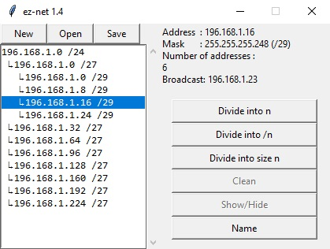
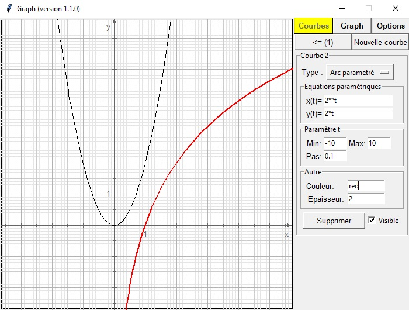

# Python Stuff
Where I store small Python projects

* [EZ Net](#ez-net)
* [Graph (french)](#graph-french-)
* [PI Dichotomy](#pi-dichotomy)

## EZ Net
You know what a pain it is to divide a network into subnetworks ? Not anymore with EZ Net ! (lol), just have fun

## Graph (french)
A tool to make beautiful mathematical curves

## PI Dichotomy
What happens when you execute dichotomy on PI starting with 4 ? Result : an infinite binary data, i used it to generate bitmaps and sound.
Obviously I didn't had infinite PI digits but "only" the 1st million.

Just run the script `pi-dich.py`, it will tell you what you can do such as :

